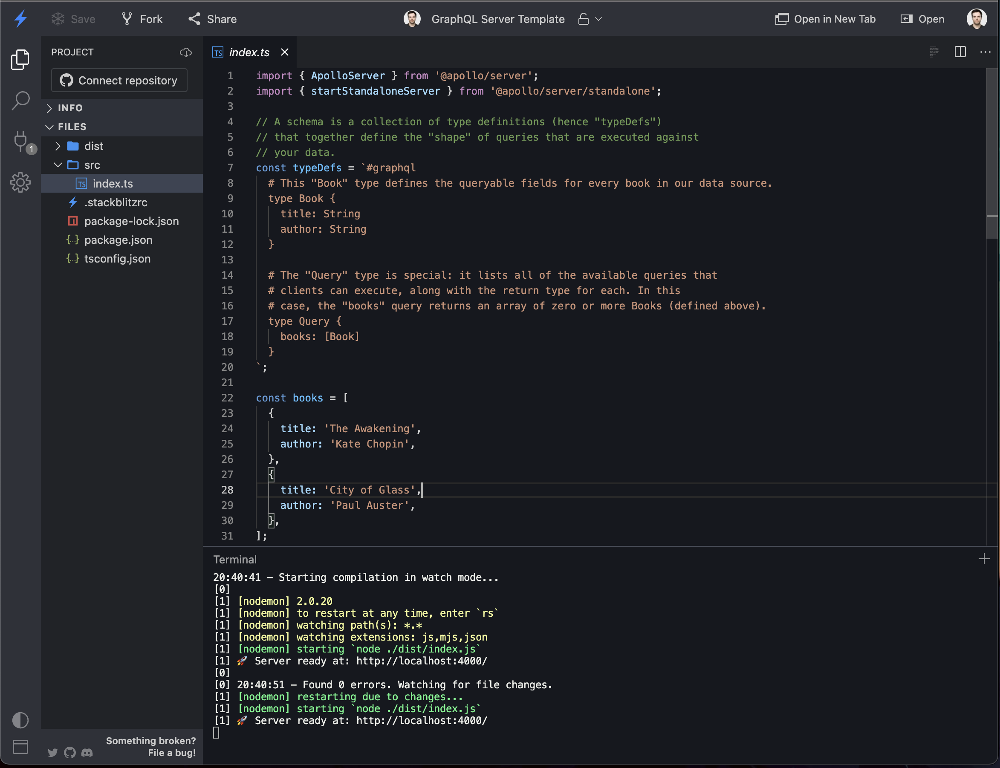
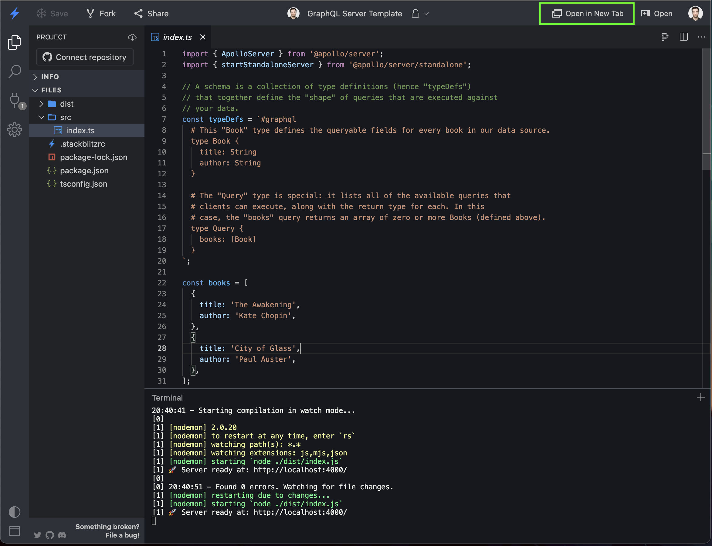
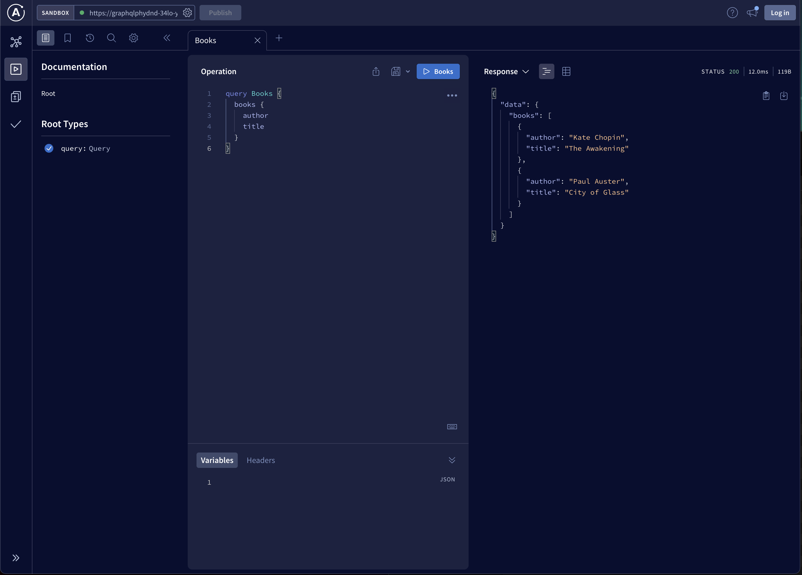

# Apollo Server

We've learned a lot about what GraphQL is, how to describe your data and how to
query and mutate your data. But so far we've only had theory. Next we're looking
at the technical implementation of a GraphQL endpoint.

GraphQL has a variety of [supported languages](https://graphql.org/code/). We'll
have a look at a JavaScript specific implementation of
[Apollo](https://www.apollographql.com/).

I've prepared a Stackblitz Web Container with a barebone example of an Apollo Server:
https://stackblitz.com/edit/graphql-phydnd?file=src%2Findex.ts



```ts
import { ApolloServer } from "@apollo/server";
import { startStandaloneServer } from "@apollo/server/standalone";

// A schema is a collection of type definitions (hence "typeDefs")
// that together define the "shape" of queries that are executed against
// your data.
const typeDefs = `#graphql
  # This "Book" type defines the queryable fields for every book in our data source.
  type Book {
    title: String
    author: String
  }

  # The "Query" type is special: it lists all of the available queries that
  # clients can execute, along with the return type for each. In this
  # case, the "books" query returns an array of zero or more Books (defined above).
  type Query {
    books: [Book]
  }
`;

const books = [
  {
    title: "The Awakening",
    author: "Kate Chopin",
  },
  {
    title: "City of Glass",
    author: "Paul Auster",
  },
];

// Resolvers define how to fetch the types defined in your schema.
// This resolver retrieves books from the "books" array above.
const resolvers = {
  Query: {
    books: () => books,
  },
};

// The ApolloServer constructor requires two parameters: your schema
// definition and your set of resolvers.
const server = new ApolloServer({
  typeDefs,
  resolvers,
});

// Passing an ApolloServer instance to the `startStandaloneServer` function:
//  1. creates an Express app
//  2. installs your ApolloServer instance as middleware
//  3. prepares your app to handle incoming requests
const { url } = await startStandaloneServer(server, {
  listen: { port: 4000 },
});

console.log(`🚀  Server ready at: ${url}`);
```

In the example we're not reading data from a database, but we have an array `books` which contains aur data. Keep in mind, that changes to this array will be thrown away when the server restarts.

To replicate this example, you can follow the instructions [here](https://www.apollographql.com/docs/apollo-server/getting-started/).

You can also just edit the files in the stackblitz and save them. Upon file save, the server is restarted.

## GraphQL Explorer

To execute your first query you can visit the the [GraphQL Exporer](https://www.apollographql.com/docs/graphos/explorer/sandbox/) that is integrated in `ApolloServer`. It provides a graphical UI to interact with our server.

The explorer doesn't run inside of stackblitz, but opening the output on stackblitz in a separate tab, fixes that problem for us.



Should open:



Add the following into the Operations field and run your first query:

```gql
query Books {
  books {
    author
    title
  }
}
```

This should return the following data:

```json
{
  "data": {
    "books": [
      {
        "author": "Kate Chopin",
        "title": "The Awakening"
      },
      {
        "author": "Paul Auster",
        "title": "City of Glass"
      }
    ]
  }
}
```

Congrats 🎉, you've just executed your first query.

## Resolvers

In the example we can see it takes two parts to startup an `ApolloServer`. The `typDefs` which contains our schema definitions, and the resolvers.

Resolvers are functions that resolve a field in a GraphQL query or mutation. When a client sends a query or mutation to a GraphQL server, the server executes the request by calling the appropriate resolver functions for each field in the query or mutation.

Resolvers are responsible for fetching the data for a field, or for performing an operation (such as creating or updating a record). They are defined in a `resolvers` object, which maps the fields in the GraphQL schema to functions that resolve the fields.

For example, consider the following GraphQL schema:

```gql
type Query {
  users: [User]
  user(id: ID!): User
}

type User {
  name: String
  email: String
  age: Int
}
```

To resolve the `users` and `user` fields in the `Query` type, the server could define the following resolvers:

```ts
const resolvers = {
  Query: {
    users: () => db.getUsers(),
    user: (parent, args) => db.getUser(args.id),
  },
};
```

In this example, the `users` and `user` resolvers fetch data from a database (represented by the db object).

### Resolver arguments

Resolver functions can take up to four arguments: `parent`, `args`, `context`,
and `info`.

- `parent`: This is the result of the previous resolver in the field's resolver
  chain. In a GraphQL query or mutation, the server executes the resolvers for
  the fields in a depth-first manner, meaning that it resolves the innermost
  fields first and then works its way outward. The parent argument allows
  resolvers to access the result of the previous resolver in the chain.

- `args`: This is an object that contains the arguments passed to the field in
  the query or mutation. For example, if the field takes an id argument, the
  args object would contain a id property with the value of the id argument
  passed in the query or mutation.

- `context`: This is an object that contains contextual information that can
  be shared across all resolvers in the server. The context object is typically
  used to store information such as the authenticated user, the database
  connection, or other shared resources.

- `info`: Thi is an object that contains metainformation of the request.

Here is an example of a resolver function that takes all three arguments:

```ts
const resolvers = {
  Query: {
    user: (parent, args, context) => {
      // `parent` is the result of the previous resolver in the chain
      // `args` is an object containing the arguments passed to the field
      // `context` is the context object shared across all resolvers
      const user = context.db.getUser(args.id);
      return user;
    },
  },
};
```

In this example, the `user` resolver function fetches a user from the database using the `id` argument passed in the query, and the `context` object to access the database connection.

### Resolvers Parent Object

The `parent` object is something special. The `parent` object contains the result of the previous resolver.

Given the following schema:

```gql
type Query {
  user(id: ID!): User
}

type User {
  name: String
  email: String
  orders: [Order]
}

type Order {
  id: ID!
  price: Float
}
```

We can see that the `User` type has an `orders` field. And to resolve this `orders` field, we need to access data from the resolver of the `user` field. The `user.id` to be exact.

```ts
const resolvers = {
  Query: {
    user: (parent, args, context) => {
      const user = context.db.getUser(args.id);
      return user; // This will be the `parent` in the `User` type resolvers
    },
  },
  User: {
    orders: (parent, args, context) => {
      // Access the user id by `parent.id`
      const orders = context.db.getOrders(parent.id);
      return orders;
    },
  },
};
```

## Practice 🔥

For the practice, start from the [Stackblitz](https://stackblitz.com/edit/graphql-4ouppb?file=src%2Findex.ts).  
After finishing, share your fork with Dominic or me (Sany).

### Queries

- [ ] Add a `book` field on the `Query` type that takes an `id` as an argument and then the corresponding resolver for that field.
- [ ] Add an `Author` type in the schema (see the `authors` data for model).
- [ ] Adapt the `Book` type so that the `author` field returns a `Author`.
- [ ] Add a resolver to the `Book` type, so that the `author` field returns the `Author` of said book.
- [ ] Add a `author` & `authors` field to the `Query` type and the corresponding resolver. The `author` field should take an argument `id` and return that `Author` type.
- [ ] Add pagination functionality to both the `books` & `authors` fields by adding two arguments `take` & `skip`. Adapt both the resolvers of those fields so that we can execute one query fetching the first two books, and then another query to fetch the next two books.

### Mutations

- [ ] Add a `Mutation` type and the field `bookAdd` to that type.
  - [ ] The `bookAdd` field should take two arguments `title: String` and `author: ID!`
  - [ ] Add a resolver for the `bookAdd` field that saves the Book our `books` array.
    - [ ] When an author id is provided that doesn't exist in the `authors` array, the resovler should throw an error.
    - [ ] The Resolver should return the newly created Book, including it's id
- [ ] Add the functionality to update a book
